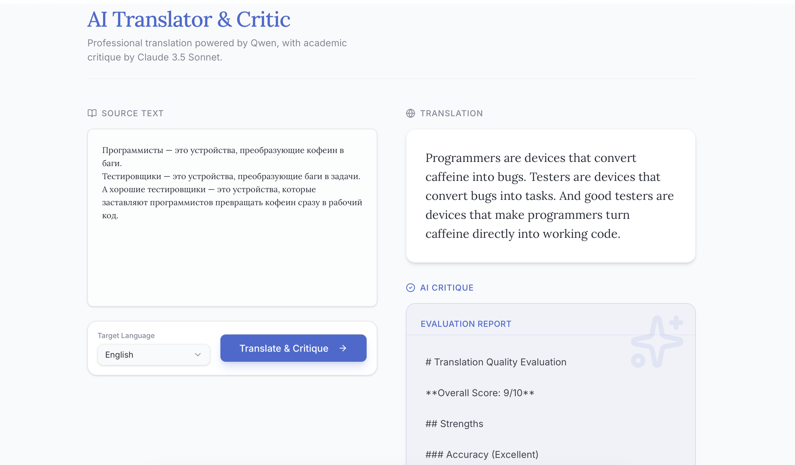

# AI Translator & Critic  
Академический переводчик + интеллектуальный критик на базе Qwen + Claude




Современный минималистичный UI ▪ Анимации Framer Motion ▪ Шрифты Inter + Lora ▪ Один клик — перевод и глубокая критика

## Быстрый запуск (рекомендуемый способ — всё работает из браузера за 15 секунд)

```bash
git clone https://github.com/gutugo/ai-translator-critic.git
cd ai-translator-critic

npm install
npm run dev:client

Открой в браузере → http://localhost:5000


=======================================

# Технологии

React 19 + TypeScript
Vite 7
Tailwind CSS 4 + Radix UI + shadcn/ui
Framer Motion 12
Sonner toasts
Прямые запросы к API

=======================================

# Структура проекта

.
├── client/             → React + Vite фронтенд
├── server/             → Node.js/Express бэкенд (не обязателен для демо)
├── shared/             → общие типы и схемы
├── attached_assets/    → скриншоты и текстовые примеры
└── README.md           → ты здесь

